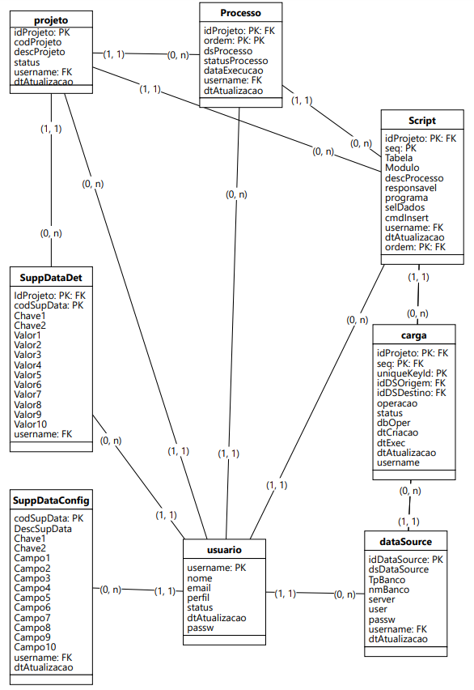

# Data Migration Web App

Este é um aplicativo web desenvolvido em Python usando Flask e SQLAlchemy para gerenciar configurações de banco de dados e realizar migrações de dados.

## Funcionalidades

- **CRUD de Configurações de Banco de Dados**: Adicionar, visualizar, atualizar e deletar configurações de banco de dados.
- **Suporte a Vários Bancos de Dados**: Inicialmente suporta SQLite, Oracle e SQL Server.
- **Criptografia de Senhas**: As senhas são armazenadas de forma criptografada e podem ser recuperadas de forma segura.

## Tecnologias Utilizadas

- Python
- Flask
- SQLAlchemy
- Cryptography

## Instalação

1. Clone o repositório:
    ```bash
    git clone https://github.com/arodri10-br/MigAction.git
    cd MigAction
    ```

2. Crie um ambiente virtual e ative-o:
    ```bash
    python -m venv venv
    venv\Scripts\activate
    ```

3. Instale as dependências:
    ```bash
    pip install -r requirements.txt
    ```
    Para verificar como esta a sua instalação:
    ```bash
    pip freeze
    ```

## Configuração

1. Geração da chave de criptografia:
    ```python
    from cryptography.fernet import Fernet
    key = Fernet.generate_key()
    print(key.decode())
    ```
   Copie a chave gerada e substitua a variável `key` no arquivo `sysdb.py`.

## Modelo de Dados

https://app.brmodeloweb.com/#!/publicview/67992aa4e177a1ec3519582c



## Uso

1. Execute o aplicativo:
    ```bash
    python app.py
    ```

2. Acesse o aplicativo em `http://127.0.0.1:5000`.
